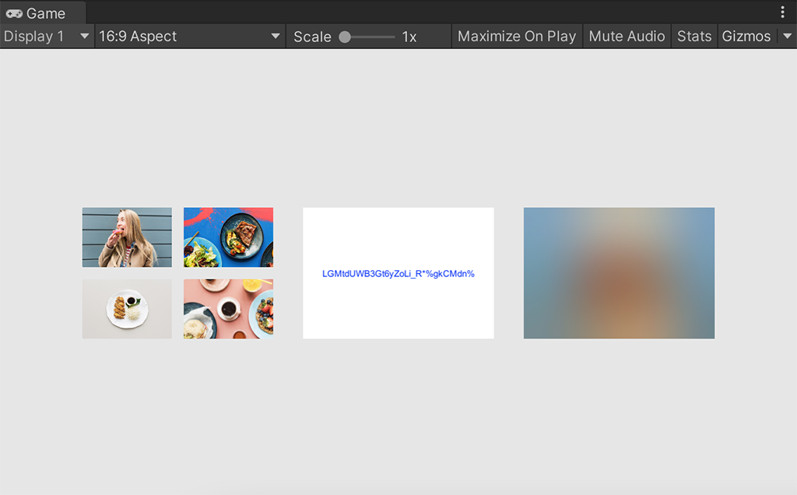

# [BlurHash](http://blurha.sh)



BlurHash encode/decode for Unity.

This repo wrapped [MarkusPalcer](https://github.com/MarkusPalcer)/**[blurhash.net](https://github.com/MarkusPalcer/blurhash.net)** for simple to use in Unity.


## Usage

1. Download [`BlurHash.unitypackage`](https://github.com/pofulu/unity-blurhash/releases/latest/download/BlurHash.unitypackage) and import it you project

2. `using Blurhash.Unity;` and use the following method to encode/decode:

```C#
BlurHash.EncodeToBlurHash(Texture2D);
```

```C#
BlurHash.DecodeToTexture2D(BlurHash);
BlurHash.DecodeToColor32(BlurHash);
```